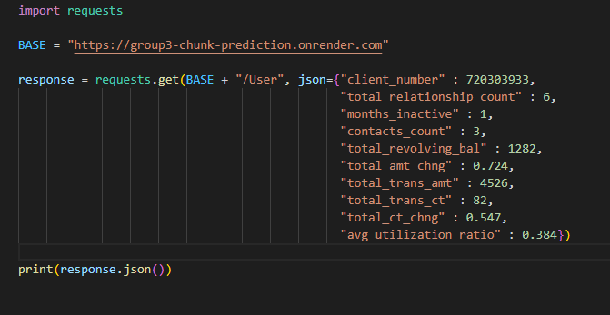
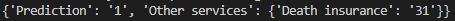

# Churn prediction :

## Description :

This is a project where we had , using a given client database of a financial instition , to increase the revenue generated from credit cardholders.
By seeing wich customers are the most capable of closing their account. (So the financial instition can start a targeted marketing campaign)

## The Team 

We are working as a team of 3 : 1 data analyst (Sheetal Saini : sainisheetal) , 1 data engineer (Andy Gilet : andygilet) and 1 machine learning engineer (Zakaria Adem-hassan : SPMK22).

## The Mission :

### Data Engineers

- [X] Build a database from the customer data.
- [X] Deploy an application for the marketing team to predict the churn rate for new client using Docker.
- [X] Create a pipeline that incorporates the work from your colleagues (e.g. deployed app should use the model developed by the ML engineer and dashboard developed by the data analyst).

### ML Engineers
- [X] Predict those clients with more propensity to close their bank account with the financial institution.
- [X] Build machine learning models for classification and/or clustering.
- [ ] Identify the optimal number of clusters and be able to describe them.
- [X] Find possible groups of clients and define their characteristics alongside the data analyst.

### Data Analysts
       
- [X] Build a dashboard with data insights and KPIs. 
- [X] Clean and explore the data to provide insights to the marketing team and ML engineers.
- [X] Apply some of the tools in Tableau to perform clustering analysis and compare your results with the ML engineers.  
- [X] Use the information provided by the ML engineers and your own analysis to create sample client profiles.

#### The Data :

The data used for this project is available here : 

[Credit Card Customers](https://www.kaggle.com/sakshigoyal7/credit-card-customers)

## Model selection & accuracy :

As the machine learning engineer of the team , I have tried multiple models before finding the right one (wich is a Decision tree)
After trying a lot of them , I wasn't pleased with the result (bad accuracy & bad metrics) , I kept the XGBOOST , Logistic Regression & Decision Tree.
The XGBoost had the best accuracy but bad metrics , same for Logistic Regression , so we're left with the Decision Tree , who has good metrics & a good accuracy as you can see : 

## Data Analysis :
1.Build the Dashboard with data insights and KPI's
2. Analysed the data in Pandas 
3. Performed clustering analysis with Tableau.
4. Prepared Client Profile

## Deployment explaination : 

Our app work as as an API and a REST API. You can acsess a web page (https://group3-chunk-prediction.onrender.com/home) to enter data with a webform linked to flask and get a prediction if the client is about to churn.

You can also make request on the API to get a dictionnary containing the result of the prediction (1 = about to churn, 0 = not about to churn) and what other services of the bank the client has. To make sure the request are correct, I used a requestParser to make sure the request to the API are correct.

The other services of the client are currently stored in a json file but one of the amelioration we were thinking about was to use a no_sql database and connect it to the app to replace this file.

The data from the CSV we got at the start of the project is stored in an intern database and can be access with a class User that implement some basic functions that hide the SQL from the user. (Yes, SQL can be really scary)

Two sets of function can be used to get the datas as a User variable or as a panda dataframe.
